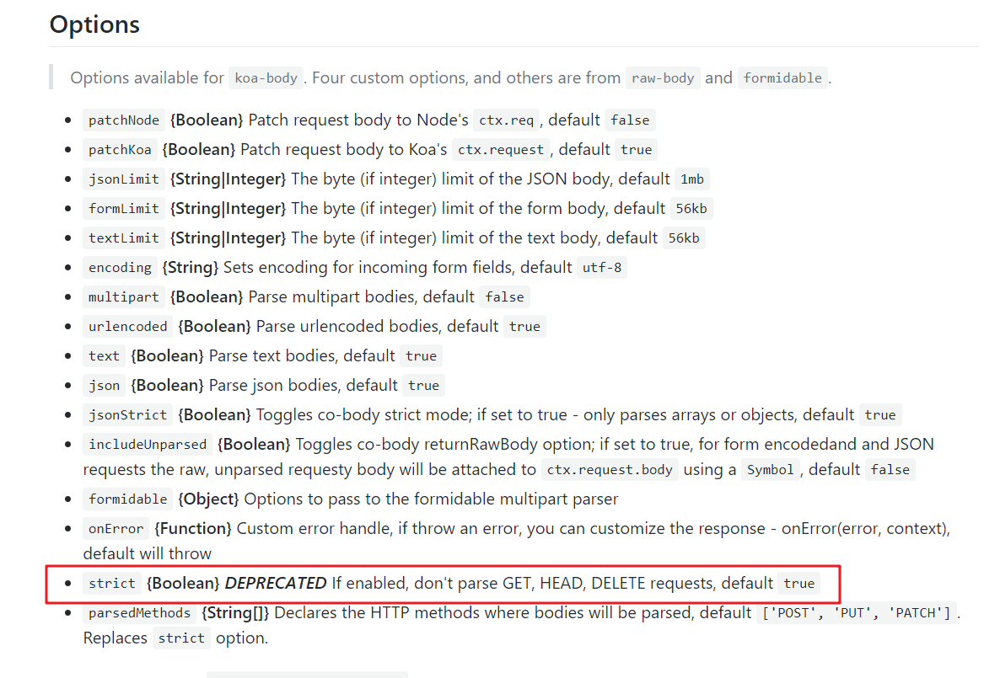

# 使用koa-body中间件后DELETE请求中ctx.request.body内容为空

## 出现场景
在使用koa-body 做文件上传的时候,发现使用DELETE请求时,request.body中的内容为空对象{}

### app.js
```js
//code...
const Koa = require('koa');

const koaBody = require("koa-body");

app.use(koaBody({
    multipart: true,
    formidable: {
        maxFileSize: 200 * 1024 * 1024
    }
}))
//...code
```
## 问题原因
查阅[官方文档](https://github.com/dlau/koa-body)找到原因<br>



**strict {Boolean} DEPRECATED If enabled, don't parse GET, HEAD, DELETE requests, default true**

strict 参数:如果启用，则不解析GET，HEAD，DELETE请求，默认为true

## 解决方案
```js
//...code
app.use(koaBody({
    multipart: true,
    strict:false,//设为false
    formidable: {
        maxFileSize: 200 * 1024 * 1024
    }
}))
//...code
```
## 接下来即可正常解析body中的内容
```js
// 前端请求(jquery)
$.ajax({
    url:`${baseUrl}/xxx`,
    type:"DELETE",
    headers:{
        "content-type":"application/json"
    },
    data:{
        name:"小明",
        age:18
    }
}).then(res=>{
    console.log(res);
})


// 后端处理函数部分
const fn_testDelete=async(ctx,next)=>{
    const {name,age}=ctx.request.body;
    console.log(name,age);//小明 18
    ctx.response.body={
        code:200,
        errMsg:"OK"
    }
}
```